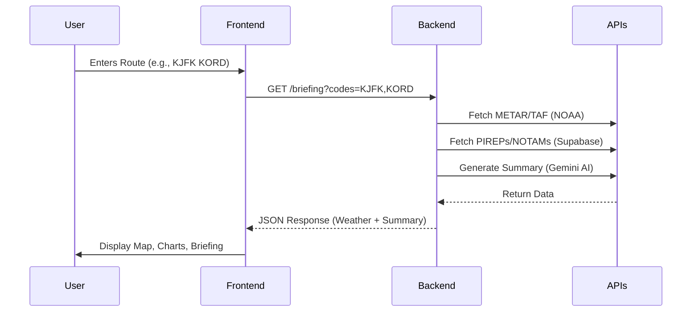

# ApacheAI - Intelligent Aviation Weather Briefings

**ApacheAI** is a next-generation aviation weather briefing system designed to provide pilots with clear, actionable, and AI-enhanced weather insights. By aggregating data from official sources (METARs, TAFs), integrating community reports (PIREPs), and leveraging Google's Gemini AI, ApacheAI transforms raw data into comprehensive flight briefings.

## Key Features

*   **AI-Powered Analysis**: Generates natural language summaries of weather conditions using Google Gemini 2.5, adhering to specific pilot profiles (e.g., VFR, IFR).
*   **Interactive Route Mapping**: 
    *   Visualizes great-circle routes on a dynamic Leaflet map.
    *   Markers for Departure, Destination, and Waypoints.
    *   Color-coded markers based on flight category (VFR, MVFR, IFR, LIFR).
    *   Antimeridian-safe rendering for long-haul flights.
*   **Dynamic Weather Visualization**:
    *   Real-time charts for Temperature, Wind Speed/Gusts, Visibility, Altimeter, and Dew Point along the route.
    *   Responsive Chart.js implementation.
*   **Voice Assistant**: 
    *   Hands-free PIREP creation using voice commands (e.g., "Problem is...").
    *   Triggered via Right-Alt key with visual transcript feedback.
*   **PIREP Management**:
    *   **Submission**: Convert natural language (text or voice) into standardized PIREP format.
    *   **Retrieval**: Fetches relevant PIREPs for the route from the last 6 hours.
*   **NOTAM Integration**: Fetches and displays Notices to Air Missions relevant to the selected route.
*   **PDF Briefing Export**: Generates professional, offline-ready PDF briefings containing all route details, weather summaries, and charts.
*   **Performance Calculations**: Estimates fuel burn, time enroute, and distance based on aircraft profiles (C172, B737, A320).
*   **Alternative Route Suggestions**: (MVP Placeholder) Logic to suggest safer routes based on adverse weather.

---

## System Architecture

ApacheAI follows a modern full-stack architecture with a Flask backend serving a robust Vanilla JS frontend.

```mermaid
graph TD
    subgraph "Frontend (Browser)"
        UI["User Interface"]
        Map["Leaflet Map"]
        Charts["Chart.js Graphs"]
        Voice["Voice Assistant Module"]
    end

    subgraph "Backend (Flask)"
        Server["Flask Server"]
        Routes["API Routes"]
        PDF["PDF Generator (wkhtmltopdf)"]
        AI_Logic["AI Logic (engtopirep.py)"]
    end

    subgraph "External Services"
        Gemini["Google Gemini AI"]
        Supabase["Supabase DB (PostgreSQL)"]
        NOAA["AviationWeather.gov API"]
    end

    UI --> Routes
    Voice --> UI
    Routes --> NOAA : "Fetch METAR/TAF"
    Routes --> Supabase : "Fetch/Store PIREPs & NOTAMs"
    Routes --> AI_Logic
    AI_Logic --> Gemini : "Generate Summary/PIREP"
    Routes --> PDF : "Generate Briefing PDF"
```

### Data Flow Diagram



---

## Codebase Structure & Components

### 1. Backend (`/` root)
The backend is built with **Flask** and handles API requests, data aggregation, and PDF generation.

*   `get_weather.py`: **Main Application Entry Point**.
    *   Initializes Flask app.
    *   Configures Gemini AI and Supabase.
    *   defines routes: `/`, `/briefing`, `/download-briefing`, `/api/convert-to-pirep`.
    *   Handles PDF generation using `pdfkit`.
*   `engtopirep.py`: **AI Logic Module**.
    *   Specialized script to convert natural language pilot reports into standardized PIREP strings using Gemini.
*   `notams.sql` / `notams_data.sql`: **Database Schema**.
    *   SQL definitions for the `NOTAMs` table in Supabase.
*   `templates/`: **Jinja2 Templates**.
    *   `briefing_template.html`: The HTML template used to generate the downloadable PDF briefing.

### 2. Frontend (`/aura`)
The frontend is a Single Page Application (SPA) served by Flask.

*   `aura/index.html`: **Main HTML Structure**.
    *   Loads TailwindCSS (CDN), Leaflet (CDN), Chart.js (CDN), and custom styles.
    *   Contains the mounting point `<div id="app">`.
    *   Includes the global loader and rain overlay effects.
*   `aura/app.js`: **Core Application Logic**.
    *   **Router**: Simple hash-based interaction handling (Landing -> Plan -> Briefing).
    *   **State Management**: `AppState` object tracks route, weather data, and params.
    *   **Components**:
        *   `renderLanding()`: Hero section with feature cards.
        *   `renderFlightPlan()`: Input form for route, aircraft, and toggles.
        *   `renderBriefing()`: Main dashboard with Summary, Map, and Charts.
    *   **Visualizations**:
        *   `createWeatherGraphs()`: Renders Chart.js instances.
        *   `initMapIfData()`: Renders Leaflet map with Great Circle routes.
    *   **Voice Assistant**: Singleton module handling microphone input and speech recognition.
*   `aura/styles.css`: **Custom Styling**.
    *   Contains animations (glow effects, shimmer), map marker styles, and overrides for standard components.

---

## Installation & Setup

### Prerequisites
*   Python 3.8+
*   `wkhtmltopdf` (Required for PDF generation)
*   Supabase Account (for Database)
*   Google Cloud Account (for Gemini API)

### 1. Clone the Repository
```bash
git clone <repository-url>
cd apache-msc
```

### 2. Install Dependencies
```bash
pip install -r requirements.txt
```
*(Note: If `requirements.txt` is missing, install: `flask requests python-dotenv google-generativeai pdfkit`)*

### 3. Configure Environment Variables
Create a `.env` file in the root directory:

```env
# API Keys
GEMINI_API_KEY=your_google_gemini_key
SUPABASE_URL=your_supabase_project_url
SUPABASE_SERVICE_KEY=your_supabase_service_role_key

# Optional Configuration
PILOT_PROFILE="General aviation VFR pilot"
```

### 4. Database Setup
Run the SQL scripts in your Supabase SQL Editor to create the necessary tables:
*   Run content of `notams.sql`

### 5. Install wkhtmltopdf
*   **Windows**: Download installer from [wkhtmltopdf.org](https://wkhtmltopdf.org/downloads.html).
*   **Linux**: `sudo apt-get install wkhtmltopdf`
*   **macOS**: `brew install wkhtmltopdf`

### 6. Run the Application
```bash
python get_weather.py
```
Access the app at `http://localhost:5001`.

---

## User Workflow

1.  **Landing Page**: Click "Start Briefing".
2.  **Flight Planning**:
    *   Enter ICAO codes (e.g., `VIDP VABB`).
    *   Select Aircraft Type (Affects performance calcs).
    *   Toggle "Include NOTAMs" if desired.
    *   Click "Generate Briefing".
3.  **Briefing Dashboard**:
    *   **Read**: View the AI-generated "Primary Route Briefing".
    *   **Visualize**: Check the Map for route and flight categories.
    *   **Analyze**: Review the temperature/wind charts below the map.
    *   **Expand**: Click "Read More" for per-airport raw METAR/TAF data.
4.  **Export/Share**:
    *   Click "Download PDF" to get a comprehensive report.
    *   Click "Share" to copy the briefing URL.
5.  **Submit PIREP** (Optional):
    *   Use the "Convert PIREP" section or Voice Assistant to submit a report.

---

## Contribution

Contributions are welcome! Please follow these steps:
1.  Fork the repository.
2.  Create a feature branch (`git checkout -b feature/NewFeature`).
3.  Commit your changes.
4.  Push to the branch.
5.  Open a Pull Request.

---

## � License

[MIT License](LICENSE) © 2024 ApacheAI Team
