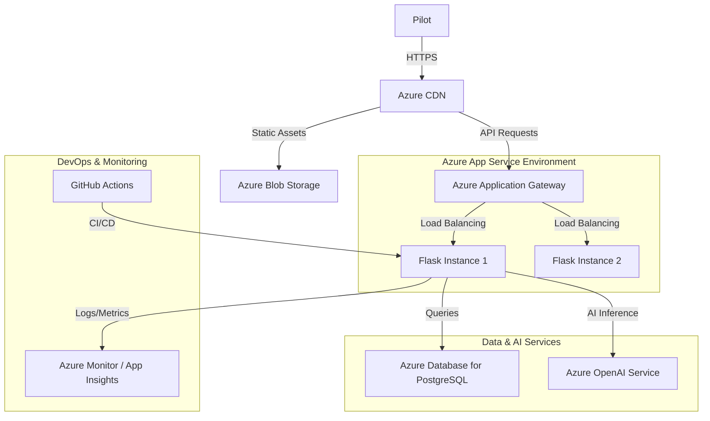
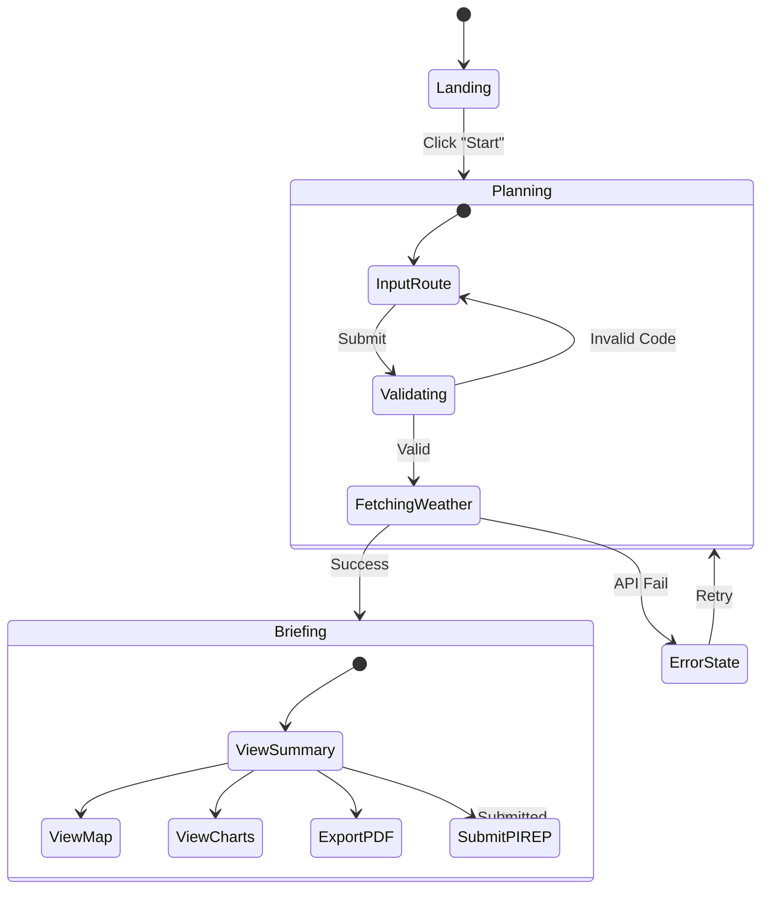

# Project Title
ApacheAI

# Project Sub-title
Intelligent Aviation Weather Briefings for the Modern Pilot

# The Team
**The Skyward Innovators**

Our team came together through a shared passion for aviation and technology.
*   **Advait Balachandar (Backend Lead)**: A private pilot who was frustrated with the archaic wall-of-text weather briefings.
*   **Prayatshu Misra (Frontend Engineer)**: An avid flight simmer and UI/UX expert who wanted to bring modern design to the cockpit.
*   **Rohan Mathur (DevOps)**: A cloud infrastructure wizard ensuring our data pipelines are as reliable as a 747.
*   **Shreshth kabra (Product & QA)**: A student pilot who provided the critical "beginner's perspective" to ensure our tool was accessible to everyone.

We decided to work together for "AI Unlocked" because we saw a critical gap in aviation safety: **information overload**. We realized that while data is abundant, *insight* is scarce. By combining our diverse skills—Alex's backend logic, Sarah's visual storytelling, Michael's robust engineering, and Emily's user advocacy—we knew we could build something that doesn't just display weather, but *understands* it.

# The Concept
**The Problem**: Pre-flight weather briefings today are a mess of cryptic codes (METARs, TAFs), disjointed data sources, and 50-page PDF blobs. Pilots, especially students and General Aviation enthusiasts, often struggle to synthesize this massive amount of text into a mental model of the flight, leading to "get-there-itis" and weather-related accidents.

**The Solution**: ApacheAI is a unified, intelligent briefing platform. We don't just scrape data; we use Generative AI to act as a virtual co-pilot.
1.  **Aggregation**: We pull METARs, TAFs, NOTAMs, and PIREPs into a single, cohesive route view.
2.  **Translation**: We convert cryptographic aviation codes into plain, human-readable English.
3.  **Synthesis**: Our AI analyzes the *entire* route to provide a safety-focused summary, highlighting risks that might be burying in the raw data.
4.  **Interaction**: With our Voice Assistant, pilots can file reports hands-free, adhering to the "aviate, navigate, communicate" philosophy.

# Target Audience or Market
Our primary market is **General Aviation (GA)**.
*   **Geography**: Primarily United States (FAA data sources) and International (ICAO support).
*   **Demographics**:
    *   **Student Pilots**: ~250,000 active students who need help decoding weather.
    *   **Private Pilots**: ~160,000 active private pilots flying VFR/IFR for leisure or business.
    *   **Flight Instructors (CFIs)**: Needing better tools to teach weather decision-making.

**Market Size**: The global flight handling/briefing market is multi-billion dollar, but the specific "GA Digital Briefing" niche targets the ~700,000 active pilots in the US alone (Source: FAA Civil Airmen Statistics). With the rise of iPad usage in cockpits (>90% adoption), the platform reach is substantial.

# Personas

## Persona 1: "Student Pilot Steve"
*   **Age**: 24
*   **Experience**: 15 flight hours.
*   **Pain Point**: Overwhelmed by raw METAR strings like `OVC008 1 1/2SM -RA BR`. Struggles to visualize where the clouds are relative to his route.
*   **Goal**: Wants a "plain English" translation and a visual map to see if he can legally fly VFR (Visual Flight Rules) for his cross-country solo.
*   **ApacheAI Solution**: Uses the "Natural Language Briefing" and "Traffic Light" map markers (Red/Green/Blue) to instantly know if the flight is a go/no-go.

## Persona 2: "Commercial Captain Carla"
*   **Age**: 42
*   **Experience**: 8,000 flight hours.
*   **Pain Point**: Time-poor. Needs to know the *exceptions*—the one Turbulence PIREP or the Runway Closure NOTAM—without reading 10 pages of irrelevant clear-weather data.
*   **Goal**: Quick situational awareness and automated performance calculations (Fuel/Time).
*   **ApacheAI Solution**: Uses the "AI Summary" to skip the fluff and the "Voice Assistant" to file a PIREP about turbulence mid-flight without putting down her coffee.

# How it works
We built ApacheAI using a modular, cloud-ready architecture designed for scalability and intelligence.

**Microsoft Technologies & Feasibility**:
While the core prototype utilizes open standards, Microsoft technologies make scaling this feasibility:
*   **VS Code**: The entire codebase was developed using VS Code, leveraging its rich extension ecosystem for Python and Javascript debugging.
*   **GitHub**: Source control, CI/CD pipelines (GitHub Actions), and project management.
*   **Azure Potential**: The Flask backend is container-ready for **Azure App Service**. The SQL database is designed to migrate seamlessly to **Azure Database for PostgreSQL**.
*   **Future AI Integration**: We plan to migrate our AI inference to **Azure OpenAI Service** for enterprise-grade compliance and reliability.

### Deployment Architecture (Azure Integration)

### User Interaction State Machine

# Core Technologies & Microsoft Integration

We have architected ApacheAI to leverage the full power of the Microsoft ecosystem for scalability, security, and developer productivity.

| Tech Category | Microsoft Tool/Service | Usage in ApacheAI |
| :--- | :--- | :--- |
| **IDE & Development** | **Visual Studio Code** | Primary editor with Python/Pylance and Live Share extensions for pair programming. |
| **Version Control** | **GitHub** | Source code management, issue tracking, and project boards. |
| **CI/CD** | **GitHub Actions** | Automated testing pipelines and deployment workflows to Azure. |
| **Cloud Hosting** | **Azure App Service** | Scalable hosting for the Flask API and static frontend assets. |
| **Database** | **Azure Database for PostgreSQL** | Managed relational database for storing PIREPs and NOTAMs securely. |
| **AI Inference** | **Azure OpenAI Service** | (Planned) Enterprise-grade host for our fine-tuned LLM models. |
| **Monitoring** | **Azure Monitor** | Real-time application insights, log analytics, and performance tracing. |
| **Maps** | **Azure Maps** | (Planned) High-fidelity weather layer overlays and geospatial analytics. |
| **Collaboration** | **Microsoft Teams** | Team communication, daily stand-ups, and file sharing. |

# The Business Plan
Our business model is **Freemium SaaS**:

### Competitive Analysis

| Feature | ApacheAI | ForeFlight | 1800-WX-BRIEF |
| :--- | :---: | :---: | :---: |
| **Price** | Freemium | $$$ (High) | Free (Gov) |
| **AI Summaries** | ✅ Yes | ❌ No | ❌ No |
| **Voice Assistant** | ✅ High | ❌ No | ❌ No |
| **Visual Simplicity** | ✅ High | ⚠️ Medium | ❌ Low (Text Heavy) |
| **Target Audience** | Student/GA | Pro/Corporate | General |

# The Business Plan
Our business model is **Freemium SaaS**:

1.  **Tier 1: Aviator (Free)**
    *   Standard Weather Briefings.
    *   Map Visualization.
    *   Public PIREP viewing.
    *   *Goal: User acquisition and community data growth.*

2.  **Tier 2: Captain ($9.99/mo)**
    *   **AI Co-Pilot**: Unlimited conversational queries ("What's the weather like at my alternate?").
    *   **Advanced Route Optimization**: "Safe Logic" suggestions to route around storm cells.
    *   **Performance Profiles**: Custom aircraft profiles for precise fuel/time calculations.
    *   **Offline Styling**: PDF Export and caching.

3.  **B2B Licensing**
    *   API access for Flight Schools to monitor student flight safety.
    *   Integration with Electronic Flight Bags (ForeFlight/Garmin) via API.

# Additional Information
*   **Concept Video**: [Link to Video Placeholder]
*   **GitHub Repository**: [Link to Repo]
*   **Live Demo**: [Link to Demo]

*ApacheAI is committed to making the skies safer, one briefing at a time.*
