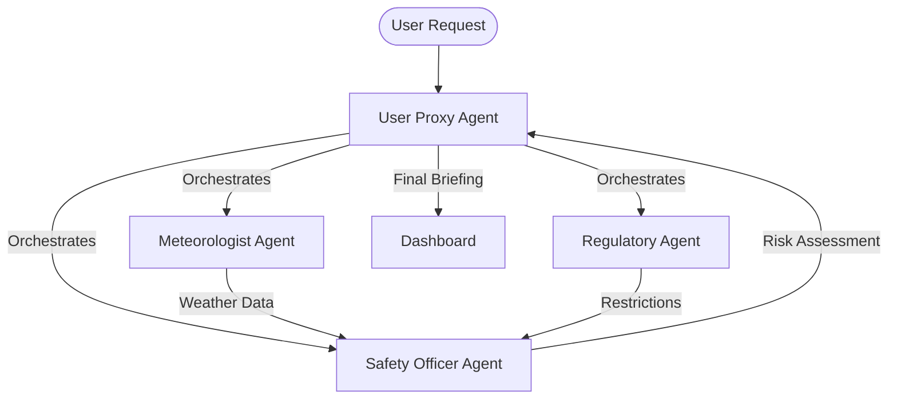

# Project Title
ApacheAI

# Project Sub-title
Intelligent Aviation Weather Briefings for the Modern Pilot

# The Team
**Team- Errorists**

Our team came together through a shared passion for aviation and technology — driven by the belief that complex aviation data can be transformed into clear, actionable insights for pilots.

* Advait Balachandar **(Backend Lead)**: A second-year Artificial Intelligence and Machine Learning student and private pilot who leads backend development. Advait built the weather ingestion system, implemented METAR/TAF parsing logic, and developed the core APIs that power our briefing engine.

* Prayatshu Misra **(Product Interface Engineer)**: A second-year Artificial Intelligence and Machine Learning student and avid flight simmer focused on user-centered design. He designs intuitive dashboards, interactive weather maps, and data visualizations to ensure pilots can quickly interpret critical information.

* Rohan Mathur **(DevOps Engineer)**: A second-year Information Technology student specializing in cloud systems. Rohan manages deployment, CI/CD pipelines, and infrastructure setup to ensure our platform runs reliably and securely.

* Shreshth Kabra **(ML Engineer)**: A second-year Computer Science student who develops AI-powered summarization and PIREP-generation workflows. He works on model fine-tuning, data preprocessing, and validating outputs to ensure technical accuracy and aviation relevance.

We decided to work together for "AI Unlocked" because we saw a critical gap in aviation safety: **information overload**. We realized that while data is abundant, *insight* is scarce. By combining our diverse skills - Advait's backend architecture, Prayatshu's visual storytelling, Rohan's robust engineering, and Shreshth's ML logic - we knew we could build something that doesn't just display weather, but *understands* it.

# The Concept
**The Problem**: Pre-flight weather briefings today are a mess of cryptic codes (METARs, TAFs), disjointed data sources, and 50-page PDF blobs. Student pilots are often overwhelmed by the sheer volume of data, leading to rote memorization rather than true understanding. This "data saturation" makes it difficult for trainees to build a mental model of the atmosphere, a critical skill for safe flight.

**The Solution**: ApacheAI is a unified, intelligent briefing platform. We don't just scrape data; we use Generative AI to act as a virtual co-pilot.
1.  **Aggregation**: We pull METARs, TAFs, NOTAMs, and PIREPs into a single, cohesive route view.
2.  **Translation**: We convert cryptographic aviation codes into plain, human-readable English.
3.  **Synthesis**: Our AI analyzes the *entire* route to provide a safety-focused summary, highlighting risks that might be burying in the raw data.
4.  **Interaction**: With our Voice Assistant, pilots can file reports hands-free, adhering to the "aviate, navigate, communicate" philosophy.

# Target Audience or Market
Our primary market is **General Aviation (GA)**.
*   **Geography**: Primarily United States (FAA data sources) and International (ICAO support).
*   **Demographics**:
    *   **Student Pilots**: ~250,000 active students who use the platform as a **training aid** to compare raw data with AI explanations.
    *   **Flight Instructors (CFIs)**: Needing visual tools to teach weather theory and decision-making.
    *   **Flight Simulation Enthusiasts**: A massive market (over 2 million MSFS users) seeking realistic flight planning tools.

**Market Size**: The global flight handling/briefing market is multi-billion dollar, but the specific "GA Digital Briefing" niche targets the ~700,000 active pilots in the US alone (Source: FAA Civil Airmen Statistics). With the rise of iPad usage in cockpits (>90% adoption), the platform reach is substantial.

# Personas

## Persona 1: "Student Pilot Steve"
*   **Age**: 24
*   **Experience**: 15 flight hours.
*   **Pain Point**: Overwhelmed by raw METAR strings like `OVC008 1 1/2SM -RA BR`. Struggles to visualize where the clouds are relative to his route.
*   **Goal**: Wants a "plain English" translation and a visual map to see if he can legally fly VFR (Visual Flight Rules) for his cross-country solo.
*   **ApacheAI Solution**: Uses the "Natural Language Briefing" and "Traffic Light" map markers (Red/Green/Blue) to instantly know if the flight is a go/no-go.

## Persona 2: "Academy Director Daniel"
*   **Age**: 42
*   **Experience**: 8,000 flight hours, manages a fleet of 12 training aircraft.
*   **Pain Point**: Oversees dozens of daily training flights and needs a fast, consolidated view of weather risks, NOTAMs, runway closures, and airspace changes across multiple routes—without digging through lengthy briefings for each student sortie.
*   **Goal**: Maintain operational safety and efficiency across the academy. Quickly assess training-day viability, identify risk trends (e.g., recurring turbulence or crosswind issues), and make data-informed go/no-go decisions for instructors and students.
*   **ApacheAI Solution**: Uses the AI Summary to get a high-level operational snapshot for all scheduled routes and the interactive dashboard to monitor weather trends and NOTAM updates in real time. Leverages automated brief generation to standardize pre-flight prep across instructors, ensuring consistency and safety throughout the academy.

# How it works
We built ApacheAI using a modular, cloud-ready architecture designed for scalability and intelligence.

**Microsoft Technologies & Feasibility**:
While the core prototype utilizes open standards, Microsoft technologies make scaling this feasibility:
*   **VS Code**: The entire codebase was developed using VS Code, leveraging its rich extension ecosystem for Python and Javascript debugging.
*   **GitHub**: Source control, CI/CD pipelines (GitHub Actions), and project management.
*   **Azure Potential**: The Flask backend is container-ready for **Azure App Service**. The SQL database is designed to migrate seamlessly to **Azure Database for PostgreSQL**.
*   **Future AI Integration**: We plan to migrate our AI inference to **Azure OpenAI Service** for enterprise-grade compliance and reliability.

### Microsoft Flight Simulator (MSFS 2024) Integration Roadmap
We see a massive opportunity to scale ApacheAI by integrating directly with **Microsoft Flight Simulator**. This allows us to serve the dual market of real-world training and high-fidelity simulation.

1.  **SimConnect Bridge (.NET)**:
    *   We are building a background service using **C# and SimConnect SDK**.
    *   This service reads the aircraft's live position (Lat/Lon/Alt) from MSFS and forwards it to our backend.
    *   **Benefit**: The ApacheAI dashboard automatically updates the weather briefing as the virtual flight progresses.

2.  **In-Game Panel (WASM/HTML/JS)**:
    *   We will wrap our frontend into an **MSFS Toolbar Panel** using the Coherent GT/HTML5 standard.
    *   **No Alt-Tab Required**: Simmers can view the live weather briefing, METARs, and TAFs directly inside the virtual cockpit.

3.  **Weather Injection (Future)**:
    *   Using the MSFS Weather SDK, we plan to inject *historical* weather scenarios (e.g., "The 2021 Texas Freeze") to let students practice flying in challenging conditions that match our AI briefings.

### Deployment Architecture (Azure Integration)

### User Interaction State Machine

# Core Technologies & Microsoft Integration

We have architected ApacheAI to leverage the full power of the Microsoft ecosystem for scalability, security, and developer productivity. We are actively transitioning key components to **.NET** and **AutoGen** to enhance performance and intelligence.

| Tech Category | Microsoft Tool/Service | Usage in ApacheAI |
| :--- | :--- | :--- |
| **Multi-Agent Framework** | **Microsoft AutoGen** | Orchestrates a team of specialized AI agents (Weather, Safety, Regulations) to debate and synthesize the final briefing. |
| **High-Performance Backend** | **.NET 8 (ASP.NET Core)** | (Roadmap) Migrating data ingestion microservices to .NET for high-throughput processing and type safety. |
| **IDE & Development** | **Visual Studio Code** | Primary editor with Python/Pylance and Live Share extensions for pair programming. |
| **Version Control** | **GitHub** | Source code management, issue tracking, and project boards. |
| **CI/CD** | **GitHub Actions** | Automated testing pipelines and deployment workflows to Azure. |
| **Cloud Hosting** | **Azure App Service** | Scalable hosting for the Flask API and static frontend assets. |
| **Database** | **Azure Database for PostgreSQL** | Managed relational database for storing PIREPs and NOTAMs securely. |
| **AI Inference** | **Azure OpenAI Service** | (Planned) Enterprise-grade host for our fine-tuned LLM models. |
| **Monitoring** | **Azure Monitor** | Real-time application insights, log analytics, and performance tracing. |
| **Collaboration** | **Microsoft Teams** | Team communication, daily stand-ups, and file sharing. |

### Multi-Agent Architecture (AutoGen)

We are moving beyond simple LLM calls to a **Multi-Agent Conversation** model using **Microsoft AutoGen**. Instead of one AI trying to do everything, we employ specialized agents:
1.  **Meteorologist Agent**: Fetches raw data and identifies severe weather patterns.
2.  **Regulatory Agent**: Checks NOTAMs and TFRs (Temporary Flight Restrictions).
3.  **Safety Officer Agent**: Reviews the findings of the first two agents and flags "Go/No-Go" decisions based on the pilot's personal minimums.
4.  **User Proxy Agent**: Synthesizes the final output into the dashboard.

# The Lifecycle of a Briefing (End-to-End Workflow)

Here is how the project executes a request from start to finish, integrating these technologies:

**1. Scalable Ingestion (.NET Core)**
*   The process begins when a user submits a route. The request hits our high-performance **ASP.NET Core** gateway.
*   This service rapidly concurrently fetches flight data (METARs, TAFs) from NOAA and PIREPs from our Azure Database.
*   We chose .NET here for its asynchronous I/O performance, ensuring we can handle thousands of concurrent pilot requests during peak flying hours.

**2. Intelligent Processing (Python & AutoGen)**
*   The raw data is passed to our **AutoGen** microservice.
*   The **Meteorologist Agent** parses semantic weather data.
*   The **Safety Agent** cross-references this with the specific aircraft profile (e.g., C172 cannot fly into known icing).
*   The agents "discuss" edge cases—for example, if visibility is marginal but trending upwards, the Safety Agent might recommend a delayed departure rather than a cancellation.

**3. Delivery & Interaction (Azure & JS)**
*   The synthesized "Consensus Briefing" is returned to the **Azure App Service**.
*   The frontend renders the interactive map using **Azure Maps** (planned) or Leaflet.
*   The user interacts via Voice, which is processed by browser APIs and sent back to the backend for logging.

# The Business Plan
Our business model is **Freemium SaaS**:

### Competitive Analysis

| Feature | ApacheAI | ForeFlight | 1800-WX-BRIEF |
| :--- | :---: | :---: | :---: |
| **Price** | Freemium | $$$ (High) | Free (Gov) |
| **AI Summaries** | ✅ Yes | ❌ No | ❌ No |
| **Voice Assistant** | ✅ High | ❌ No | ❌ No |
| **Visual Simplicity** | ✅ High | ⚠️ Medium | ❌ Low (Text Heavy) |
| **Target Audience** | Student/GA | Pro/Corporate | General |

# The Business Plan
Our business model is **Freemium SaaS**:

1.  **Tier 1: Aviator (Free)**
    *   Standard Weather Briefings.
    *   Map Visualization.
    *   Public PIREP viewing.
    *   *Goal: User acquisition and community data growth.*

2.  **Tier 2: Captain ($9.99/mo)**
    *   **AI Co-Pilot**: Unlimited conversational queries ("What's the weather like at my alternate?").
    *   **Advanced Route Optimization**: "Safe Logic" suggestions to route around storm cells.
    *   **Performance Profiles**: Custom aircraft profiles for precise fuel/time calculations.
    *   **Offline Styling**: PDF Export and caching.

3.  **B2B Licensing**
    *   API access for Flight Schools to monitor student flight safety.
    *   Integration with Electronic Flight Bags (ForeFlight/Garmin) via API.

# Additional Information
*   **Concept Video**: [Link to Video Placeholder]
*   **GitHub Repository**: [Link to Repo]
*   **Live Demo**: [Link to Demo]

*ApacheAI is committed to making the skies safer, one briefing at a time.*
